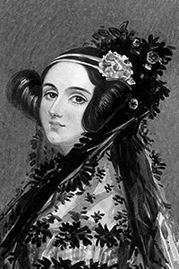
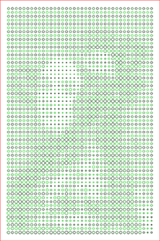
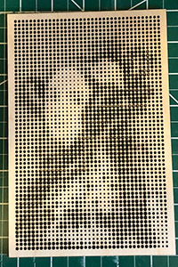

# circle-art

This is a small program that takes a bitmap image and converts it to a grid of SVG circles.  The size of the circles depends on the intensity of the image at that point.

I created this for laser cutting on a [Glowforge](https://glowforge.com) laser cutter.  It can probably be adapted to other cutters and things like plotters.

## Example

| Input | SVG | Cut |
|-------|-----|-----|
||||

## WARNING!

This is alpha software and you could literally light your house on fire if you aren't careful.  Lasers can lay down a lot of heat and these designs concentrate a lot of it in a small area.  Please stay by your laser as it is cutting and watch for flare ups.

The output is set up with multiple colors with the idea that you cut one color at a time.  This offsets the circles being cut in order to let things cool down before you cut again right next to a previous cut.  This is based on experience.

## Install and Usage

Right now the only way to get this running is to have Go installed on your machine and work from the command line.  I may package this up at some point for download via other mechanisms or host it on a web site but for now it is a little fiddly.

You can probably do a `go get github.com/jbeda/circle-art` and have it show up in your `$GOPATH/bin` directory.  Or you can clone this repo and run `go run *.go <input-file>`.

There are a bunch of constants in `constants.go` that you can play with.  I'll probably turn those into command line flags at some point.